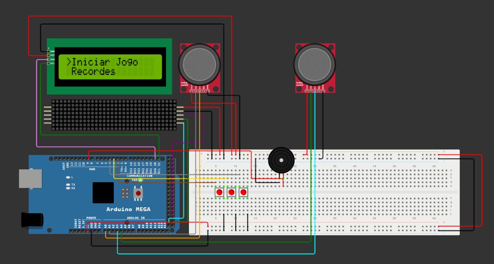

# snake-arduino-IC

> Um console de jogo dedicado, construído com Arduino, para uma versão do clássico jogo Snake em um display de matriz de LED 32x8.

Este projeto foi desenvolvido por um grupo de estudantes do primeiro período de Engenharia da Computação como requisito para a Feira de Ciências da disciplina de Introdução à Computação.

---

## Índice

- [Sobre o Projeto](#sobre-o-projeto)
- [Componentes Necessários](#componentes-necessários-hardware)
- [Montagem e Conexões](#montagem-e-conexoes)
- [Instalação do Software](#instalação-do-software)
- [Como Jogar](#como-jogar)
- [Equipe](#equipe)
- [Licença](#licença)

---

## Sobre o Projeto

O objetivo principal foi aplicar de forma prática os conhecimentos de hardware e software em um desafio interativo. A ideia foi construir um console de jogo totalmente funcional e autocontido, desde a concepção do circuito até a programação da lógica do jogo, focando em criar uma experiência polida e nostálgica do jogo Snake.


> Circuito real montado

---

## Componentes Necessários (Hardware)

| Qtd. | Componente |
| :--: | :--- |
| 1 | Placa Arduino Mega 2560 R3 |
| 1 | Módulo Matriz de LED 8x8 com MAX7219 (Kit 4-em-1) |
| 2 | Módulo Joystick Analógico 2 Eixos com Botão |
| 1 | Módulo Display LCD 16x2 com Interface I2C |
| 1 | Buzzer Passivo 5V |
| 1 | Kit de Jumpers (M-M, M-F e F-F) |
| 1 | Protoboard (Placa de Ensaio) 830 pontos |
| 2 | Push Buttons |

---
## Montagem e Conexões
### Diagrama da Montagem

A montagem do circuito foi desenhada utilizando o simulador Wokwi para facilitar o trabalho em equipe e clareza. O Arduino é alimentado via USB, com os terras (GND) de ambos os circuitos conectados para garantir uma referência comum.


>Circuito no simulador

### Tabela de Conexões (Pinout)

| Componente | Pino do Componente | Pino do Arduino |
| :--- | :--- | :--- |
| **Matriz de LED** | DIN | 51 |
| | CLK (Clock) | 52 |
| | CS (Load) | 53 |
| **Joystick 1** | VRx | A0 |
|               | VRy | A1 |
| **Joystick 2** | VRx | A3 |
|               | VRy | A4 |
| **Buzzer** | DPIN (Digital Pin)|9 |
| **LCD I2C** | SDA | 20 |
|             | SCL | 21 |
|**Push Button(Centro)** |DPIN |3 |
|**Push Button(Direita)** |DPIN |4 |

---

## Instalação do Software

Para rodar o jogo no seu próprio Arduino, siga os passos abaixo:

1.  **Clone o Repositório**
    ```sh
    git clone https://github.com/rafaelvlt/snake-arduino-IC.git
    ```

2.  **Abra na IDE do Arduino**
    Abra o arquivo `main.ino` do projeto na sua IDE do Arduino.

3.  **Instale as Bibliotecas Necessárias**
    Este projeto requer bibliotecas externas. Instale-as através do Gerenciador de Bibliotecas da IDE (`Ferramentas > Gerenciar Bibliotecas...`):
    -   `LedControl`
    -   `LiquidCrystal I2C`
    -   `EEPROM`

4.  **Faça o Upload**
    Conecte sua placa Arduino Mega, selecione a porta correta em `Ferramentas > Porta` e clique no botão de Upload.

---

## Como Jogar

1.  Após o upload, o jogo exibirá o menu inicial.
2.  Selecione Iniciar o jogo para começar a jogar
3.  Selecione Recordes para ver high scores passados
4.  Use o **joystick 1** ou **joystick 2** para mover as respectivas cobras na direção desejada.
5.  O objetivo é "comer" os pontos que aparecem na tela, fazendo a cobras crescer, e fechar o oponente para que ele perca.
6.  O jogo termina se uma das cobras colidir com o próprio corpo, ou com o corpo do oponente.
7.  Tente bater o recorde!

---

## Equipe

Este projeto foi idealizado e construído por:

-   [Rafael Barbosa](https://github.com/rafaelvlt)
-   [Caio Amarante](https://github.com/IrineuACgasoso)
-   [Eric Santiago](https://github.com/ARISE21)
-   [Nina Schettini](https://github.com/schettinina)
-   [Heitor Luiz](https://github.com/heitorlui-z)
-   [João Aquino](https://github.com/JoaoAquino117)
-   [Gabriel Zarour](https://github.com/GabrieIing)
---

## Licença

Distribuído sob a licença MIT. Veja o arquivo `LICENSE` para mais informações.
